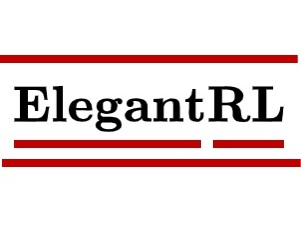

## Lightweight, Efficient and Stable DRL Implementation Using PyTorch 

 
<a href="https://github.com/AI4Finance-LLC/ElegantRL" target="\_blank">
	

		
	

<!-- 	
<caption>Slack Invitation Link</caption>
 -->
</a>
 

ElegantRL is featured with **lightweight, efficient and stable**, for researchers and practitioners.
  
  + **Lightweight**: The core codes  <1,000 lines, using PyTorch, OpenAI Gym, and NumPy.
  
  + **Efficient**: performance is comparable with [Ray RLlib](https://github.com/ray-project/ray).
  
  + **Stable**: as stable as [Stable Baseline 3](https://github.com/DLR-RM/stable-baselines3).

Model-free deep reinforcement learning (DRL) algorithms: 
+ **DDPG, TD3, SAC, A2C, PPO(GAE)** for continuous actions
+ **DQN, DoubleDQN, D3QN** for discrete actions

For algorithm details, please check out [OpenAI Spinning Up](https://spinningup.openai.com/en/latest/). 

### Model-free DRL Algorithms

More policy gradient algorithms (Actor-Critic style): [Policy gradient algorithms](https://lilianweng.github.io/lil-log/2018/04/08/policy-gradient-algorithms.html)

# File Structure

-----kernel file----
+ eRL/net.py    # Neural networks.
+ eRL/agent.py  # Model-free RL algorithms.
+ eRL/run.py    # run and learn the DEMO 1 ~ 4 in run__demo() (takes a few minutes for training)
-----utils file----
+ eRL/env.py    # gym env or custom env (MultiStockEnv Finance)
+ Examples.ipynb      # run and learn the DEMO 1 ~ 3 in jupyter notebook (new version)
+ ElegantRL-examples.ipynb  # run and learn the DEMO 1 ~ 3 in jupyter notebook (old version)

# Experimental results

Results using ElegantRL 

[LunarLanderContinuous-v2](https://gym.openai.com/envs/LunarLanderContinuous-v2/)

[BipedalWalkerHardcore-v2](https://gym.openai.com/envs/BipedalWalkerHardcore-v2/)

BipedalWalkerHardcore is a difficult task in continuous action space. There are only a few RL implementations can reach the target reward.

Check out a video on bilibili: [Crack the BipedalWalkerHardcore-v2 with total reward 310 using IntelAC](https://www.bilibili.com/video/BV1wi4y187tC).

# Requirements

    Necessary:
    | Python 3.7           
    | PyTorch 1.0.2       

    Not necessary:
    | Numpy 1.19.0    | For ReplayBuffer. Numpy will be install when installing PyTorch
    | gym 0.17.2      | For RL training env. Gym provide some tutorial env for DRL training.
    | box2d-py 2.3.8  | For gym. Use pip install Box2D (instead of box2d-py)
    | matplotlib 3.2  | For plots. Evaluate the agent performance.
It is **lightweight**.

# Run
    python3 Main.py
    # You can see run__demo(gpu_id=0, cwd='AC_BasicAC') in Main.py.
+ In default, it will train a stable-DDPG in LunarLanderContinuous-v2 for 2000 second.
+ It would choose CPU or GPU automatically. Don't worry, I never use `.cuda()`.
+ It would save the log and model parameters file in Current Working Directory `cwd='AC_BasicAC'`. 
+ It would print the total reward while training. Maybe I should use TensorBoardX?
+ There are many comment in the code. I believe these comments can answer some of your questions.

### Use other DRL algorithms?
The following steps:
1. See `run__xxx()` in `Main.py`.
2. Use `run__zoo()` to run an off-policy algorithm. Use `run__ppo()` to run on-policy such as PPO.
3. Choose a DRL algorithm: `from Agent import AgentXXX`.
4. Choose a gym environment: `args.env_name = "LunarLanderContinuous-v2"`

# Training pipeline

+ Initialize the parameters using `args`.
+ Initialize `agent = agent.XXX()` : creates the DRL agent based on the algorithm.
+ Initialize `evaluator = Evaluator()` : evaluates and stores the trained model.
+ Initialize `buffer = ReplayBuffer()` : stores the transitions.
+ Ater the training starts, the while-loop will break when the conditions are met (conditions: achieving the target score, maximum steps, or manually breaks).
  + `agent.update_buffer(...)` The agent explores the environment within target steps, generates transition data, and stores it in the ReplayBuffer. Run in parallel.
  + `agent.update_policy(...)`  The agent uses a batch from the ReplayBuffer to update the network parameters. Run in parallel.
  + `evaluator.evaluate_act__save_checkpoint(...)` Evaluates the performance of the agent and keeps the model with the highest score. Independent of the training process.
