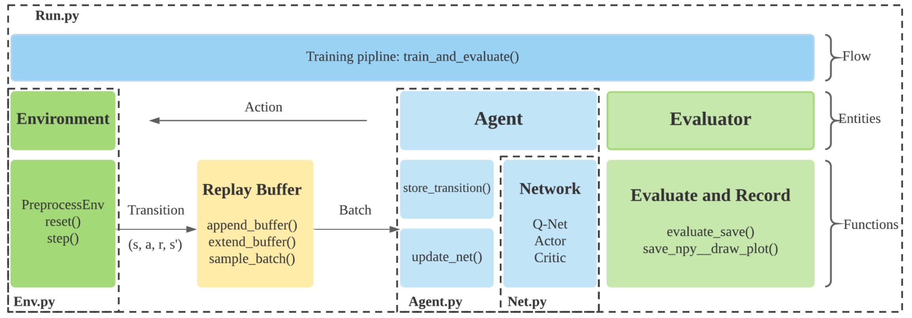
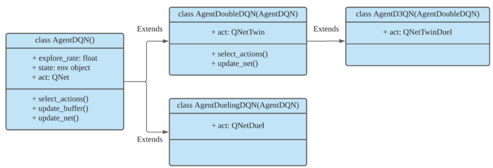
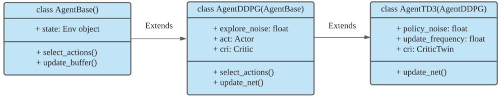
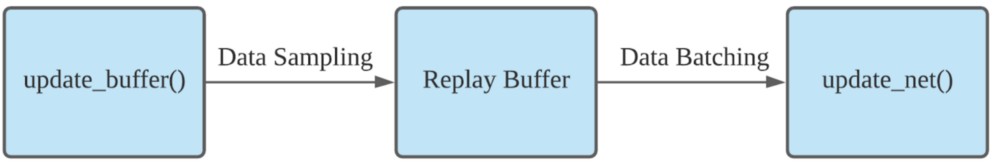

Overview
=============

Advantages of ElegantRL
----------------------------

One sentence summary: in reinforcement learning (RL), an agent learns by continuously interacting with an unknown environment, in a trial-and-error manner, making sequential decisions under uncertainty and achieving a balance between exploration (new territory) and exploitation (using knowledge learned from experiences).

Deep reinforcement learning (DRL) has great potential to solve real-world problems that are challenging to humans, such as self-driving cars, gaming, natural language processing (NLP), and financial trading. Starting from the success of AlphaGo, various DRL algorithms and applications are emerging in a disruptive manner. The ElegantRL library enables researchers and practitioners to pipeline the disruptive “design, development and deployment” of DRL technology.

The library to be presented is featured with “elegant” in the following aspects:

  - **Lightweight**: core codes have less than 1,000 lines, e.g., `tutorial <https://github.com/AI4Finance-Foundation/ElegantRL/tree/master/elegantrl/tutorial>`_.

  - **Efficient**: in many testing cases, we find it more efficient than Ray RLlib.

  - **Stable**: more stable than Stable baseline 3.
 
ElegantRL supports state-of-the-art DRL algorithms, including discrete and continuous ones, and provides user-friendly tutorials in Jupyter notebooks.

The ElegantRL implements DRL algorithms under the Actor-Critic framework, where an Agent (a.k.a, a DRL algorithm) consists of an Actor network and a Critic network. Due to the completeness and simplicity of code structure, users are able to easily customize their own agents.

Overview: File Structure and Functions
------------------------------------------

The file structure of ElegantRL is shown in Fig. 1:

  1. **Env.py**: it contains the environments, with which the agent interacts. 
  
      - A prep_env() function for gym-environment modification.
      
      - A self-created stock trading environment as an example for user customization.
      
  2. **Net.py**: There are three types of networks:(*Each includes a base network for inheritance and a set of variations for different algorithms.*)

      - Q-Net
      
      - Actor Network
      
      - Critic Network

  3. **Agent.py**: it contains agents for different DRL algorithms.

  4. **Run.py**: it provides basic functions for the training and evaluating process:
  
      - Parameter initialization
      
      - Training loop
      
      - Evaluator
      
As a high-level overview, the relations among the files are as follows. Initialize an environment from Env.py and an agent from Agent.py. The agent is constructed with Actor and Critic networks from Net.py. In each training step from Run.py, the agent interacts with the environment, generating transitions that are stored into a Replay Buffer. Then, the agent fetches transitions from the Replay Buffer to train its networks. After each update, an evaluator evaluates the agent’s performance and saves the agent if the performance is good. 

      
Implementations of DRL Algorithms
------------------------------------

This part describes DQN-series algorithms and DDPG-series algorithms, respectively. Each DRL algorithm agent follows a hierarchy from its base class.

As shown in Fig. 2, the inheritance hierarchy of the DQN-series algorithms is as follows: 
  
  - **AgentDQN**: a standard DQN agent.
  
  - **AgentDoubleDQN**: a Double-DQN agent with two Q-Nets for reducing overestimation, inheriting from AgentDQN.
  
  - **AgentDuelingDQN**: a DQN agent with a different Q-value calculation, inheriting from AgentDQN.
  
  - **AgentD3QN**: a combination of AgentDoubleDQN and AgentDuelingDQN, inheriting from AgentDoubleDQN.
  
.. code-block:: python
   :linenos:
   
    class AgentDQN:
      def __init__(net_dim, state_dim, action_dim, learning_rate=1e-4);
      def select_actions(states);  # for discrete action space
      def update_buffer(env, buffer, target_step, reward_scale, gamma);
      def update_net(buffer, max_step, batch_size, repeat_times);

    class AgentDuelingDQN(AgentDQN):
        def __init__(net_dim, state_dim, action_dim, learning_rate=1e-4);

    class AgentDoubleDQN(AgentDQN):
        def __init__(net_dim, state_dim, action_dim, learning_rate=1e-4);
        def select_actions(states);  # for discrete action space
        def update_net(buffer, max_step, batch_size, repeat_times);

    class AgentD3QN(AgentDoubleDQN):  # D3QN: Dueling Double DQN
        def __init__(net_dim, state_dim, action_dim, learning_rate=1e-4);
   
   

 
As shown in Fig. 3, the inheritance hierarchy of the DDPG-series algorithms is as follows:

  - **AgentBase**: a base class for all Actor-Critic agents.
  
  - **AgentDDPG**: a DDPG agent, inheriting from AgentBase.
  
  - **AgentTD3**: a TD3 agent with a new updating method, inheriting from AgentDDPG. 

.. code-block:: python
   :linenos:
   
    class AgentBase:
        def __init__(self);
        def select_actions(states);  # states = (state, ...)
        def update_buffer(env, buffer, target_step, reward_scale, gamma);
        def save_or_load_model(cwd, if_save);

    class AgentDDPG(AgentBase):
        def __init__(net_dim, state_dim, action_dim, learning_rate=1e-4);
        def select_actions(states);  # states = (state, ...)
        def update_net(buffer, max_step, batch_size, repeat_times);

    class AgentTD3(AgentDDPG):
        def __init__(net_dim, state_dim, action_dim, learning_rate=1e-4);
        def update_net(buffer, max_step, batch_size, repeat_times);
  

Applying such a hierarchy in building DRL agents effectively improves lightweightness and effectiveness. Users can easily design and implement new agents in a similar flow.
  

Basically, an agent has two fundamental functions, and the data flow is shown in Fig. 4:

  - **store_transition()**: it allows the agent to interact with the environment and generates transitions for training networks.
  
  - **update_net()**: it first fetches a batch of transitions from the Replay Buffer, and then train the network with backpropagation.
  

Training Pipeline
--------------------

Two major steps to train an agent:

  1. Initialization:
  
      - hyper-parameters args.
      
      - env = prep_env() : creates an environment (in the OpenAI gym format).
      
      - agent = agent.XXX : creates an agent for a DRL algorithm.
      
      - evaluator = Evaluator() : evaluates and stores the trained model.
      
      - buffer = ReplayBuffer() : stores the transitions.

  2. Then, the training process is controlled by a while-loop:
  
      - agent.store_transition(…): the agent explores the environment within target steps, generates transitions, and stores them into the ReplayBuffer.
      
      - agent.update_net(…): the agent uses a batch from the ReplayBuffer to update the network parameters.
      
      - evaluator.evaluate_save(…): evaluates the agent’s performance and keeps the trained model with the highest score.

The while-loop will terminate when the conditions are met, e.g., achieving a target score, maximum steps, or manual breaks.
