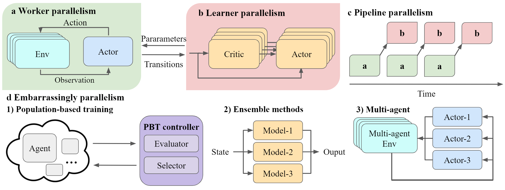

Muti-level Parallelism
==============================================

ElegantRL is a massively parallel framework for DRL algorithms. In this article, we will explain how we map the multi-level parallelism of DRL algorithms to a cloud, namely the worker/learner parallelism within a container, the pipeline parallelism (asynchronous execution) over multiple microservices, and the inherent parallelism of the scheduling task at an orchestrator.

Here, we follow a *bottom-up* approach to describe the parallelism at multiple levels.

An overview of the multi-level parallelism supported by ElegantRL. ElegantRL decomposes an agent into worker (a) and learner (b) and pipes their executions through the pipeline parallelism (c). Besides, ElegantRL emphasizes three types of inherent parallelism in DRL algorithms, including population-based training (PBT) (d1), ensemble methods (d2), and multi-agent DRL (d3).

Worker/Learner parallelism
-----------------------------------------------------------

ElegantRL adopts a worker-learner decomposition of a single agent, decoupling the data sampling process and model learning process. We exploit both the worker parallelism and learner parallelism. 

**Worker parallelism**: a worker generates transitions from interactions of an actor with an environment. As shown in the figure a, ElegantRL supports the recent breakthrough technology, *massively parallel simulation*, with a simulation speedup of 2 ~ 3 orders of magnitude. One GPU can simulate the interactions of one actor with thousands of environments, while existing libraries achieve parallel simulation on hundreds of CPUs.
  
Advantage of massively parallel simulation:
  - Running thousands of parallel simulations, since the manycore GPU architecture is natually suited for parallel simulations.
  - Speeding up the matrix computations of each simulation using GPU tensor cores.
  - Reducing the communication overhead by bypassing the bottleneck between CPUs and GPUs.
  - Maximizing GPU utilization.
  
To achieve massively parallel simulation, ElegantRL supports both user-customized and imported simulator, namely Issac Gym from NVIDIA.

A tutorial on how to create a GPU-accelerated VecEnv is available `here <https://elegantrl.readthedocs.io/en/latest/examples/Creating_VecEnv.html>`_.

A tutorial on how to utilize Isaac Gym as an imported massively parallel simulator is available `here <https://elegantrl.readthedocs.io/en/latest/tutorial/isaacgym.html>`_.

.. note::
  Besides massively parallel simulation on GPUs, we allow users to conduct worker parallelism on classic environments through multiprocessing, e.g., OpenAI Gym and MuJoCo. 

**Learner parallelism**: a learner fetches a batch of transitions to train neural networks, e.g., a critic net and an actor net in the figure b. Multiple critic nets and actor nets of an ensemble method can be trained simultaneously on one GPU. It is different from other libraries that achieve parallel training on multiple CPUs via distributed SGD.

Pipeline parallelism
-----------------------------------------------------------

We view the worker-learner interaction as a *producer-consumer* model: a worker produces transitions and a learner consumes. As shown in figure c, ElegantRL pipelines the execution of workers and learners, allowing them to run on one GPU asynchronously. We exploit pipeline parallelism in our implementations of off-policy model-free algorithms, including DDPG, TD3, SAC, etc.

Inherent parallelism
-----------------------------------------------------------
ElegantRL supports three types of inherent parallelism in DRL algorithms, including *population-based training*, *ensemble methods*, and *multi-agent DRL*. Each features strong independence and requires little or no communication. 

  - Population-based training (PBT): it trains hundreds of agents and obtains a powerful agent, e.g., generational evolution and tournament-based evolution. As shown in figure d1, an agent is encapsulated into a pod on the cloud, whose training is orchestrated by the evaluator and selector of a PBT controller. Population-based training implicitly achieves massively parallel hyper-parameter tuning.
  - Ensemble methods: it combines the predictions of multiple models and obtains a better result than each individual result, as shown in figure d2. ElegantRL implements various ensemble methods that perform remarkably well in the following scenarios: 
  
     1. take an average of multiple critic nets to reduce the variance in the estimation of Q-value;
     2. perform a minimization over multiple critic nets to reduce over-estimation bias;
     3. optimize hyper-parameters by initializing agents in a population with different hyper-parameters.
     
  - Multi-agent DRL: in the cooperative, competitive, or mixed settings of MARL, multiple parallel agents interact with the same environment. During the training process, there is little communication among those parallel agents.
