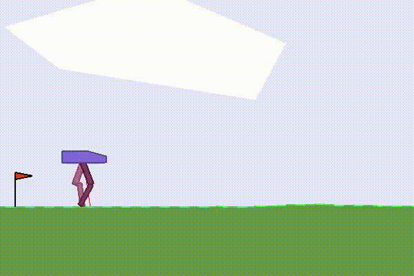

Reacher-v2
===============================

The goal of the Reacher-v2 task is simple: make a 2D robot arm to reach a randomly located target point.

Check out a **video** on bilibili: `Crack the BipedalWalkerHardcore-v2 with total reward 310 using IntelAC <https://www.bilibili.com/video/BV1wi4y187tC>`_.

Step 1: Install ElegantRL
------------------------------

.. code-block:: python
   :linenos:
   
     # install elegantrl library
     !pip install git+https://github.com/AI4Finance-LLC/ElegantRL.git
  
Step 2: Import Packages
-------------------------------

.. code-block:: python
   :linenos:
   
     from elegantrl.run import *
     from elegantrl.env import prep_env
     import elegantrl.agent as agent
     import gym
     import pybullet_envs  # for python-bullet-gym
     gym.logger.set_level(40) # Block warning

Step 3: Specify Agent and Environment
---------------------------------------------

.. code-block:: python
   :linenos:
   
     args = Arguments(if_on_policy=True)
     args.agent_rl = agent.AgentGaePPO  # choose an DRL algorithm
     args.env = prep_env(gym.make('ReacherBulletEnv-v0')) # create and preprocess the environment from gym

     args.break_step = int(5e4 * 8)  # (5e4) 1e5, UsedTime: (300s) 800s
     args.eval_times1 = 1 # the evaluation times if 'eval_reward > old_max_reward'
     args.eval_times2 = 2 # the evaluation times if 'eval_reward > target_reward'
     args.rollout_num = 4 # the number of rollout workers (larger is not always faster)

Step 4: Train and Evaluate the Agent
----------------------------------------

.. code-block:: python
   :linenos:
   
      train_and_evaluate__multiprocessing(args) # the training process will terminate once it reaches the target reward.

Step 5: Testing Results
----------------------------------------

The Reacher-v2 demo is available on colab.
