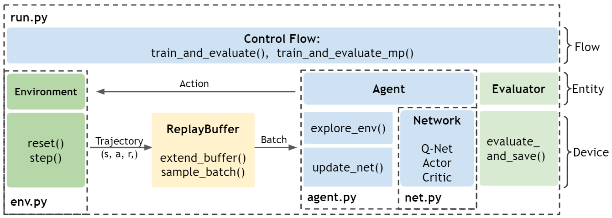

====================
Hello, World!
==================== 

We will help you understand and get hands-on experience with `ElegantRL-HelloWorld <https://github.com/AI4Finance-Foundation/ElegantRL/tree/master/elegantrl_helloworldL>`_.

.. contents:: Table of Contents
    :depth: 3

"Net-Agent-Env-Run" File Structure
=========

One sentence summary: an agent (*agent.py*) with Actor-Critic networks (*net.py*) is trained (*run.py*) by interacting with an environment (*env.py*).

As a high-level overview, the relations among the files are as follows. Initialize an environment from *env.py* and an agent from *agent.py*. The agent is constructed with Actor and Critic networks from *net.py*. In each training step from *run.py*, the agent interacts with the environment, generating transitions that are stored into a Replay Buffer. Then, the agent fetches transitions from the Replay Buffer to train its networks. After each update, an evaluator evaluates the agent’s performance and saves the agent if the performance is good.

net.py
------

Our `net.py <https://github.com/AI4Finance-Foundation/ElegantRL/blob/master/elegantrl_helloworld/net.py>`_ contains three types of networks. Each type of networks includes a base network for inheritance and a set of variations for algorithms.

    - Q-Net
      
    - Actor Network
      
    - Critic Network

agent.py
--------

`agent.py <https://github.com/AI4Finance-Foundation/ElegantRL/blob/master/elegantrl_helloworld/agent.py>`_ contains classes of different DRL agent, where each agent corresponds to a DRL algorithms. In addition, it also contains the Replay Buffer class for data storage.

In this HelloWorld, we focus on DQN, SAC, and PPO, which are the most representative and commonly used DRL algorithms.

For a complete list of DRL algorithms, please go to `here <https://github.com/AI4Finance-Foundation/ElegantRL/tree/master/elegantrl/agents>`_.

env.py
------

`env.py <https://github.com/AI4Finance-Foundation/ElegantRL/blob/master/elegantrl_helloworld/env.py>`_ contains a wrapper class that preprocesses the Gym-styled environment (env).

Refer to `OpenAI's explanation <https://github.com/openai/gym/blob/master/gym/core.py>`_ to better understand the how a Gym-styled environment is formulated.

run.py
------

`run.py <https://github.com/AI4Finance-Foundation/ElegantRL/blob/master/elegantrl_helloworld/run.py>`_ contains basic functions for the training and evaluating process. In the training process ``train_and_evaluate``, there are two major steps:

  1. Initialization:
  
      - hyper-parameters args.
      
      - env = PreprocessEnv() : creates an environment (in the OpenAI gym format).
      
      - agent = agent.XXX() : creates an agent for a DRL algorithm.
      
      - evaluator = Evaluator() : evaluates and stores the trained model.
      
      - buffer = ReplayBuffer() : stores the transitions.

  2. Then, the training process is controlled by a while-loop:
  
      - agent.explore_env(...): the agent explores the environment within target steps, generates transitions, and stores them into the ReplayBuffer.
      
      - agent.update_net(...): the agent uses a batch from the ReplayBuffer to update the network parameters.
      
      - evaluator.evaluate_save(...): evaluates the agent's performance and keeps the trained model with the highest score.

The while-loop will terminate when the conditions are met, e.g., achieving a target score, maximum steps, or manual breaks.

In **run.py**, we also provide an evaluator to periodically evaluate and save the model.

demo.py
---------------------

`demo.py <https://github.com/AI4Finance-Foundation/ElegantRL/blob/master/elegantrl_helloworld/demo.py>`_ contains four demo functions:

    - discrete action    +   off-policy algorithm
    - discrete action    +   on-policy algorithm
    - continuous action  +   off-policy algorithm
    - continuous action  +   on-policy algorithm
    

Run the Code
============

In `demo.py <https://github.com/AI4Finance-Foundation/ElegantRL/blob/master/elegantrl_helloworld/demo.py>`_, there are four functions that are available to run in the main function. You can see ``demo_continuous_action_on_policy()`` called at the bottom of the file.

.. code-block:: python

    if __name__ == '__main__':
    
        ENV_ID = 3  # int(sys.argv[2])
        # demo_continuous_action_off_policy()
        demo_continuous_action_on_policy()
        # demo_discrete_action_off_policy()
        # demo_discrete_action_on_policy()

Inside each of the four functions, we provide three tasks as demos to help you get start. You can choose the task you want to train on by setting the ``env_id``.

    - Pendulum id: 1
    
    - LunarLanderContinuous-v2 id: 2
    
    - BipedalWalker-v3 id: 3

If everything works, congratulations!  

Enjoy your journey to the DRL world with ElegantRL!
