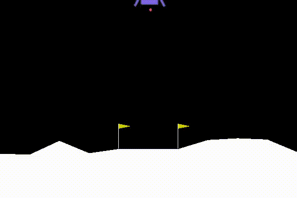

Example 1: LunarLanderContinuous-v2
========================================

LunarLanderContinuous-v2 is a robotic control task. The goal is to get a Lander to rest on the landing pad. If lander moves away from landing pad it loses reward back. Episode finishes if the lander crashes or comes to rest, receiving additional -100 or +100 points. Detailed description of the task can be found at `OpenAI Gym <https://gym.openai.com/envs/LunarLanderContinuous-v2/>`_. Our Python code is available `here <https://github.com/AI4Finance-Foundation/ElegantRL/blob/master/examples/tutorial_LunarLanderContinous-v2.py>`_.

When a Lander takes random actions:

Step 1: Install ElegantRL
------------------------------

.. code-block:: python
   
     pip install git+https://github.com/AI4Finance-LLC/ElegantRL.git
  
Step 2: Import packages
-------------------------------

   - ElegantRL
   
   - OpenAI Gym: a toolkit for developing and comparing reinforcement learning algorithms (collections of environments).
   
.. code-block:: python
   
   from elegantrl.run import *

   gym.logger.set_level(40) # Block warning

Step 3: Get environment information
--------------------------------------------------

.. code-block:: python
   
   get_gym_env_args(gym.make('LunarLanderContinuous-v2'), if_print=True)
   

Output: 

.. code-block:: python

   env_args = {
       'env_num': 1,
       'env_name': 'LunarLanderContinuous-v2',
       'max_step': 1000,
       'state_dim': 8,
       'action_dim': 4,
       'if_discrete': True,
       'target_return': 200,
       'id': 'LunarLanderContinuous-v2'
   }

Step 4: Initialize agent and environment
---------------------------------------------

   - agent: chooses a agent (DRL algorithm) from a set of agents in the `directory <https://github.com/AI4Finance-Foundation/ElegantRL/tree/master/elegantrl/agents>`_.
   
   - env_func: the function to create an environment, in this case, we use ``gym.make`` to create LunarLanderContinuous-v2.
   
   - env_args: the environment information.

.. code-block:: python
   
   env_func = gym.make
   env_args = {
       'env_num': 1,
       'env_name': 'LunarLanderContinuous-v2',
       'max_step': 1000,
       'state_dim': 8,
       'action_dim': 4,
       'if_discrete': True,
       'target_return': 200,
       'id': 'LunarLanderContinuous-v2'
   }

   args = Arguments(AgentModSAC, env_func=env_func, env_args=env_args)

Step 5: Specify hyper-parameters
----------------------------------------

A list of hyper-parameters is available `here <https://elegantrl.readthedocs.io/en/latest/api/config.html>`_.

.. code-block:: python

   args.target_step = args.max_step
   args.gamma = 0.99
   args.eval_times = 2 ** 5
   

Step 6: Train your agent
----------------------------------------

In this tutorial, we provide a single-process demo to train an agent:
   
.. code-block:: python

   train_and_evaluate(args)
   
   
Try by yourself through this `Colab <https://github.com/AI4Finance-Foundation/ElegantRL/blob/master/tutorial_LunarLanderContinuous_v2.ipynb>`_!

Performance of a trained agent:

.. image:: ../images/LunarLanderTwinDelay3.gif
   :width: 80%
   :align: center
