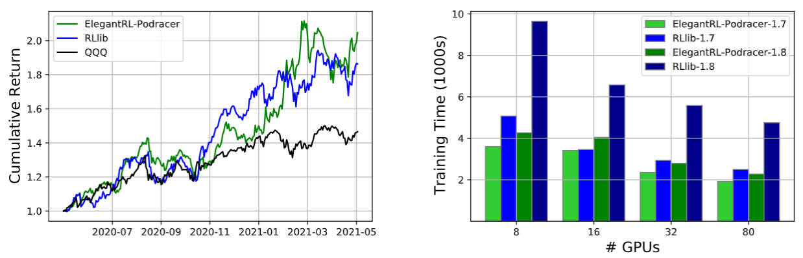
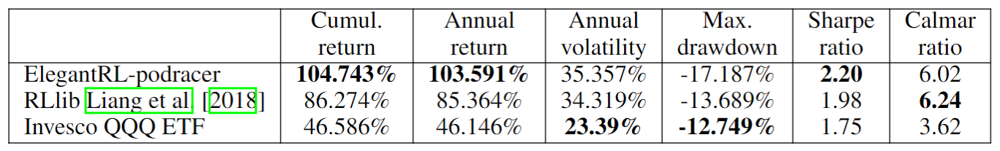

Cloud Example 2: Tournament-based Ensemble Training
======================================================================

In this section, we provide a tutorial of *tournament-based ensemble training*, to show ElegantRL's scalability on hundreds of computing nodes on a cloud platform, say, hundreds of GPUs.

For detailed description, please check our recent paper: 

Xiao-Yang Liu, Zechu Li, Zhuoran Yang, Jiahao Zheng, Zhaoran Wang, Anwar Walid, Jiang Guo, and Michael I. Jordan. `ElegantRL-Podracer: Scalable and Elastic Library for Cloud-Native Deep Reinforcement Learning. <https://arxiv.org/abs/2112.05923>`_ *Deep Reinforcement Learning Workshop at NeurIPS*, 2021.  

What is a tournament-based ensemble training?
------------------------------------------------------------

The key of the tournament-based ensemble training scheme is the interaction between a *training pool* and a *leaderboard*. The training pool contains hundreds of agents that 1) are trained in an asynchronous manner, and 2) can be initialized with different DRL algorithms/hyper-parameter setup for an ensemble purpose. The leaderboard records the agents with high performance and continually updates as more agents (pods) are trained.

.. image:: ../images/framework2.png
   :width: 100%
   :align: center

As shown in the figure above, the tournament-based ensemble training proceeds as follows:

  1. An *orchestrator* instantiates a new agent and put it into a training pool.
  
  2. A *generator* initializes an agent with networks and optimizers selected from a leaderboard. The generator is a class of subordinate functions associated with the leaderboard, which has different variations to support different evolution strategies
  
  3. An *updater* determines whether and where to insert an agent into the leaderboard according to its performance, after a pod has been trained for a certain number of steps or certain amount of time.

Comparison with generational evolution
---------------------------------------------------------------

In generational evolution, the entire population of agents is simultaneously updated for each generation.  However, this paradigm scales poorly on the cloud since it requires to finish training of every member of a large population before any further evolution can occur, imposing a significant computational burden.

Our tournament-based ensemble training updates agents asynchronously, which decouples population evolution and singleagent learning. Such an asynchronously distributed training reduce waiting time among parallel agents and reduce the agent-to-agent communication overhead. 

Example: Stock Trading
-------------------------------------------------------

Finance is a promising and challenging real-world application of DRL algorithms. We apply ElegantRL-podracer to a stock trading task as an example to show its potential in quantitative finance.

We aim to train a DRL agent that decides where to trade, at what price and what quantity in a stock market, thus the objective of the problem is to maximize the expected return and minimize the risk. We model the stock trading task as a Markov Decision Process (MDP) as in `FinRL <https://github.com/AI4Finance-Foundation/FinRL>`_. We follow a training-backtesting pipeline and split the dataset into two sets: the data from 01/01/2016 to 05/25/2020 for training, and the data from 05/26/2020 to 05/26/2021 for backtesting.

The experiments were executed using NVIDIA DGX-2 servers in a DGX SuperPOD cloud, a cloud-native infrastructure.

Left: cumulative return on minute-level NASDAQ-100 constituents stocks (initial capital $1, 000, 000, transaction cost 0.2%). Right: training time (wall-clock time) for reaching cumulative rewards 1.7 and 1.8, using the model snapshots of ElegantRL-podracer and RLlib.

All DRL agents can achieve a better performance than the market benchmark with respect to the cumulative return, demonstrating the algorithm’s effectiveness. We observe that ElegantRL-podracer has a cumulative return of 104.743%, an annual return of 103.591%, and a Sharpe ratio of 2.20, which outperforms RLlib substantially. However, ElegantRL-podracer is not as stable as RLlib during the backtesting period: it achieves annual volatility of 35.357%, max. drawdown 17.187%, and Calmar ratio 6.02. There are two possible reasons to account for such instability:

   1. the reward design in the stock trading environment is mainly related to the cumulative return, thus leading the agent to take less care of the risk;
   2. ElegantRL-podracer holds a large number of funds around 2021–03, which naturally leads to a larger slip.

We compare the training performance on a varying number of GPUs, i.e., 8, 16, 32, and 80. We measure the required training time to obtain two cumulative returns of 1.7 and 1.8, respectively. Both ElegantRL-podracer and RLlib require less training time to achieve the same cumulative return as the number of GPUs increases, which directly demonstrates the advantage of cloud computing resources on the DRL training. For ElegantRL-podracer with 80 GPUs, it requires (1900s, 2200s) to reach cumulative returns of 1.7 and 1.8. ElegantRL-podracer with 32 and 16 GPUs need (2400s, 2800s) and (3400s, 4000s) to achieve the same cumulative returns. It demonstrates the high scalability of ElegantRL-podracer and the effectiveness of our cloud-oriented optimizations. For the experiments using RLlib, increasing the number of GPUs does not lead to much speed-up.

Run tournament-based ensemble training in ElegantRL
--------------------------------------------------------------

Here, we provide a demo code to run the Isaac Gym Ant with tournament-based ensemble training in ElegantRL.

.. code-block:: python

   import isaacgym
   import torch  # import torch after import IsaacGym modules
   from elegantrl.train.config import Arguments
   from elegantrl.train.run import train_and_evaluate_mp
   from elegantrl.envs.IsaacGym import IsaacVecEnv, IsaacOneEnv
   from elegantrl.agents.AgentPPO import AgentPPO

   '''set vec env for worker'''
   env_func = IsaacVecEnv
   env_args = {
        'env_num': 2 ** 10,
        'env_name': 'Ant',
        'max_step': 1000,
        'state_dim': 60,
        'action_dim': 8,
        'if_discrete': False,
        'target_return': 14000.0,

        'device_id': None,  # set by worker
        'if_print': False,  # if_print=False in default
   }

   args = Arguments(agent=AgentPPO(), env_func=env_func, env_args=env_args)
   args.agent.if_use_old_traj = False  # todo

   '''set one env for evaluator'''
   args.eval_env_func = IsaacOneEnv
   args.eval_env_args = args.env_args.copy()
   args.eval_env_args['env_num'] = 1

   '''set other hyper-parameters'''
   args.net_dim = 2 ** 9
   args.batch_size = args.net_dim * 4
   args.target_step = args.max_step
   args.repeat_times = 2 ** 4

   args.save_gap = 2 ** 9
   args.eval_gap = 2 ** 8
   args.eval_times1 = 2 ** 0
   args.eval_times2 = 2 ** 2

   args.worker_num = 1  # VecEnv, worker number = 1
   args.learner_gpus = [(i,) for i in range(0, 8)]  # 8 agents (1 GPU per agent) performing tournament-based ensemble training
   
   train_and_evaluate_mp(args, python_path='.../bin/python3')
