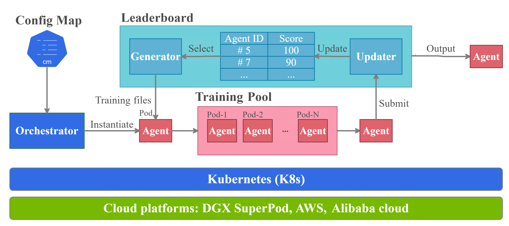
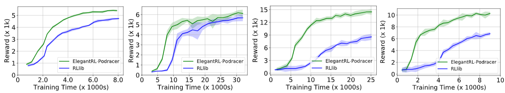
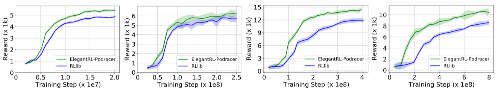

Cloud Example 2: Tournament-based Ensemble Training
======================================================================

In this section, we provide a tutorial of *tournament-based ensemble training*, to show ElegantRL's scalability on hundreds of computing nodes on a cloud platform, say, hundreds of GPUs.

For detailed description, please check our recent paper: 

Xiao-Yang Liu, Zechu Li, Zhuoran Yang, Jiahao Zheng, Zhaoran Wang, Anwar Walid, Jiang Guo, and Michael I. Jordan. `ElegantRL-Podracer: Scalable and Elastic Library for Cloud-Native Deep Reinforcement Learning. <https://arxiv.org/abs/2112.05923>`_ *Deep Reinforcement Learning Workshop at NeurIPS*, 2021.  

What is a tournament-based ensemble training?
------------------------------------------------------------

The key of the tournament-based ensemble training scheme is the interaction between a *training pool* and a *leaderboard*. The training pool contains hundreds of agents that 1) are trained in an asynchronous manner, and 2) can be initialized with different DRL algorithms/hyper-parameter setup for an ensemble purpose. The leaderboard records the agents with high performance and continually updates as more agents (pods) are trained.

As shown in the figure above, the tournament-based ensemble training proceeds as follows:

  1. An *orchestrator* instantiates a new agent and put it into a training pool.
  
  2. A *generator* initializes an agent with networks and optimizers selected from a leaderboard. The generator is a class of subordinate functions associated with the leaderboard, which has different variations to support different evolution strategies
  
  3. An *updater* determines whether and where to insert an agent into the leaderboard according to its performance, after a pod has been trained for a certain number of steps or certain amount of time.

Comparison with generational evolution
---------------------------------------------------------------

In generational evolution, the entire population of agents is simultaneously updated for each generation.  However, this paradigm scales poorly on the cloud since it requires to finish training of every member of a large population before any further evolution can occur, imposing a significant computational burden.

Our tournament-based ensemble training updates agents asynchronously, which decouples population evolution and singleagent learning. Such an asynchronously distributed training reduce waiting time among parallel agents and reduce the agent-to-agent communication overhead. 

Example: Isaac Gym
-------------------------------------------------------

We select two canonical robotic control tasks, Ant and Humanoid, where each task has both MuJoCo version and Isaac Gym verison. We compare our tournament-based ensemble training with RLlib on these four tasks. 

We employ two different metrics to evaluate the agent’s performance:

  - **Episodic reward vs. training time (wall-clock time)**: we measure the episodic reward at different training time, which can be affected by the convergence speed, communication overhead, scheduling efficiency, etc.

  - **Episodic reward vs. training step**: from the same testings, we also measure the episodic reward at different training steps. This result can be used to investigate the massive parallel simulation capability of GPUs, and also check the algorithm’s performance.

   

Run tournament-based ensemble training in ElegantRL
--------------------------------------------------------------

Here, we provide a demo code to run the Isaac Gym Ant with tournament-based ensemble training in ElegantRL.

.. code-block:: python

   import isaacgym
   import torch  # import torch after import IsaacGym modules
   from elegantrl.train.config import Arguments
   from elegantrl.train.run import train_and_evaluate_mp
   from elegantrl.envs.IsaacGym import IsaacVecEnv, IsaacOneEnv
   from elegantrl.agents.AgentPPO import AgentPPO

   '''set vec env for worker'''
   env_func = IsaacVecEnv
   env_args = {
        'env_num': 2 ** 10,
        'env_name': 'Ant',
        'max_step': 1000,
        'state_dim': 60,
        'action_dim': 8,
        'if_discrete': False,
        'target_return': 14000.0,

        'device_id': None,  # set by worker
        'if_print': False,  # if_print=False in default
   }

   args = Arguments(agent=AgentPPO(), env_func=env_func, env_args=env_args)
   args.agent.if_use_old_traj = False  # todo

   '''set one env for evaluator'''
   args.eval_env_func = IsaacOneEnv
   args.eval_env_args = args.env_args.copy()
   args.eval_env_args['env_num'] = 1

   '''set other hyper-parameters'''
   args.net_dim = 2 ** 9
   args.batch_size = args.net_dim * 4
   args.target_step = args.max_step
   args.repeat_times = 2 ** 4

   args.save_gap = 2 ** 9
   args.eval_gap = 2 ** 8
   args.eval_times1 = 2 ** 0
   args.eval_times2 = 2 ** 2

   args.worker_num = 1  # VecEnv, worker number = 1
   args.learner_gpus = [(i,) for i in range(0, 8)]  # 8 agents (1 GPU per agent) performing tournament-based ensemble training
   
   train_and_evaluate_mp(args, python_path='.../bin/python3')
