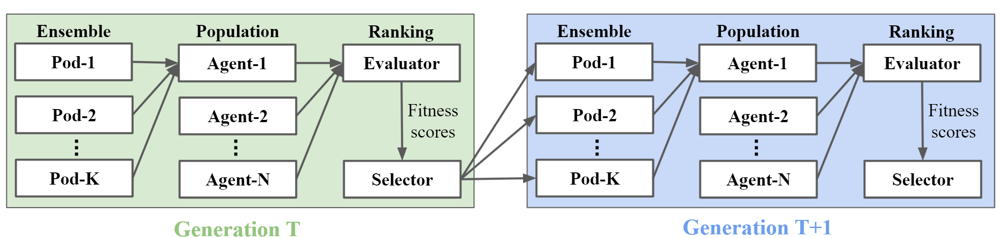
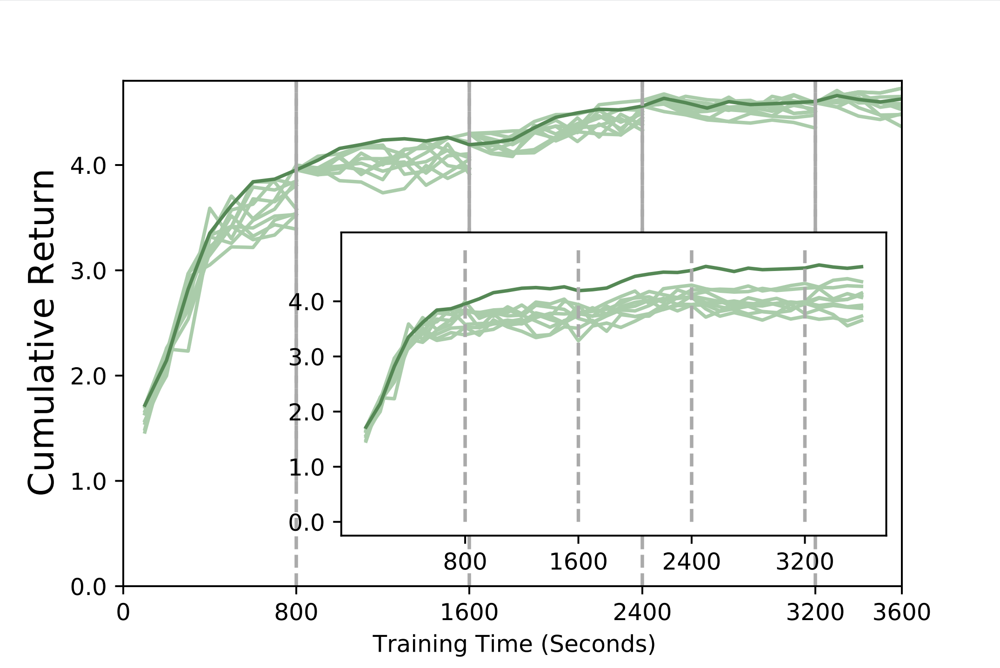
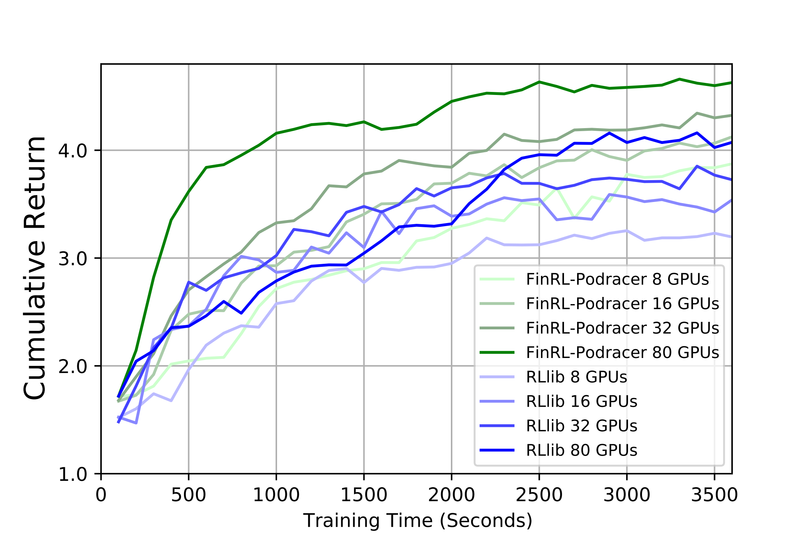

Cloud Example 1: Generational Evolution
==========================================

In this section, we provide a tutorial of *generational evolution mechanism* with an ensemble method, to show ElegantRL's scalability on hundreds of computing nodes on a cloud platform, say, hundreds of GPUs.

For detailed description, please check our recent paper: 

Zechu Li, Xiao-Yang Liu, Jiahao Zheng, Zhaoran Wang, Anwar Walid, and Jian Guo. `FinRL-podracer: High performance and scalable deep reinforcement learning for quantitative finance. <https://arxiv.org/abs/2111.05188>`_ *ACM International Conference on AI in Finance (ICAIF)*, 2021.  

The codes are available on `GitHub <https://github.com/AI4Finance-Foundation/FinRL_Podracer>`_.  

What is a generational evolution mechanism?
------------------------------------------------------------

A generational evolution mechanism with an ensemble method is a way to coordinate parallel agents in the population-based training (agent parallelism in ElegantRL). Under such a mechanism, we can initialize hundreds or even thousands of parallel agents with different hyper-parameter setups, thus performing hyper-parameter search on hundreds of GPUs of the cloud. 

In the generational evolution, we periodically update every agent in parallel to form generations, where each period can be a certain number of training steps or a certain amount of training time. For each generation, it is composed of population ranking and model ensemble, as shown in the figure below.

Population ranking
-----------------------------------------------------

The population ranking is scheduled by an `evaluator <https://elegantrl.readthedocs.io/en/latest/api/evaluator.html>`_ and a selector. 

At every generation, 

  1. A population of N agents is trained for a certain number of training steps or a certain amount of training time.
  
  2. The evaluator calculates agents' scores, e.g., episodic rewards.
  
  3. The selector ranks agents based on their scores and redistributes training files of agents with the highest scores to form a new population
  
  4. The new population of N agents continues to be trained in the next generation.
  
 
Model ensemble
------------------------------------------------------
 
In the training of each agent, we provide an ensemble method, model fusion, to stabilize its learning process. In the model fusion, we concurrently run K pods (training processes) to train each agent in parallel, where all K pods are initialized with the same hyper-parameters but different random seeds. The stochasticity brought by different random seeds increases the diversity of data collection, thus improving the stability of the learning process. After all K pods finish training, we fuse K trained models and optimzers to obtain a single model and optimizer for that agent.

At present, we achieve the model fusion in a similar fashion to the soft update of target network in DRL. For example, for models and optimizers, we have:

.. code-block:: python

  def avg_update_net(dst_net, src_net, device):
    for dst, src in zip(dst_net.parameters(), src_net.parameters()):
        dst.data.copy_((dst.data + src.data.to(device)) * 0.5)
        # dst.data.copy_(src.data * tau + dst.data * (1 - tau))
  
  def avg_update_optim(dst_optim, src_optim, device):
    for dst, src in zip(get_optim_parameters(dst_optim), get_optim_parameters(src_optim)):
        dst.data.copy_((dst.data + src.data.to(device)) * 0.5)

Example: stock trading
------------------------------------------------------------------

Finance is a promising and challenging real-world application of DRL algorithms. Therefore, we select a stock trading task as an example, which aims to train a DRL agent that decides *where to trade*, *at what price and what quantity* in a stock market. 

We select the minute-level dataset of the NASDAQ-100 constituent stocks and follow a training-backtesting pipeline to split the dataset into two sets: the data from 01/01/2016 to 05/25/2019 for training, and the data from 05/26/2019 to 05/26/2021 for backtesting. To ensure that we do not use any future information from backtesting dataset, we store the model snapshots at different training time, say every 100 seconds, then later we use each snapshot model to perform inference on the backtesting dataset and obtain the generalization performance, namely, the cumulative return.

First, we empirically investigate the generational evolution mechanism. The figure below explicitly demonstrates an evolution of N (= 10) agents on 80 A100 GPUs, where the selector chooses the best agent to train in the next generation every 800 seconds. The inner figure depicts the generalization curves of the ten agents in the first generation (without using the agent evolution mechanism). The curve with the generational evolution mechanism (the thick green curve) is substantially higher than the other ten curves. 

We compare our generational evolution mechanism with RLlib on a varying number of A100 GPUs, i.e., 8, 16, 32, and 80.

