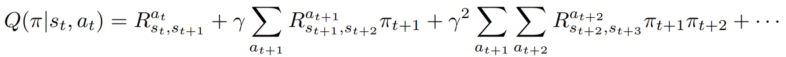
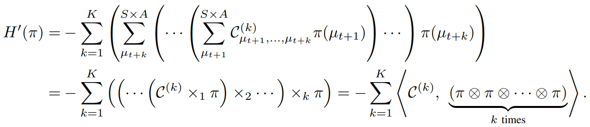
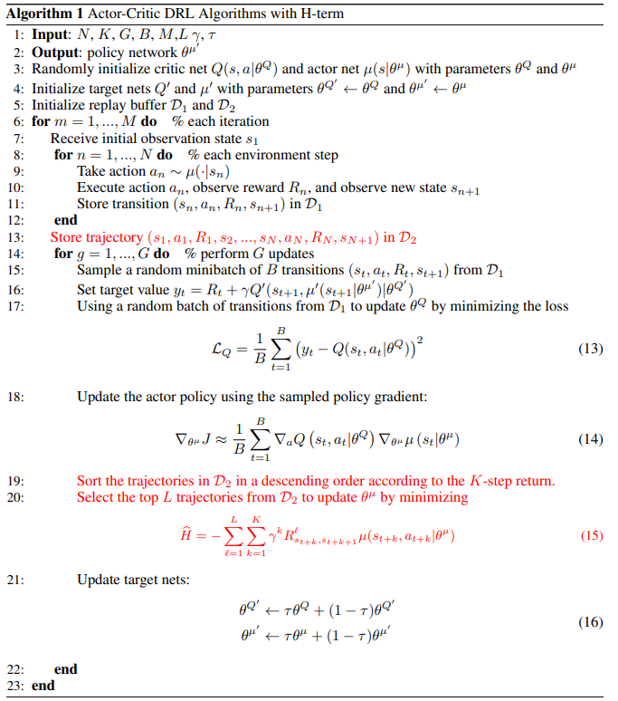
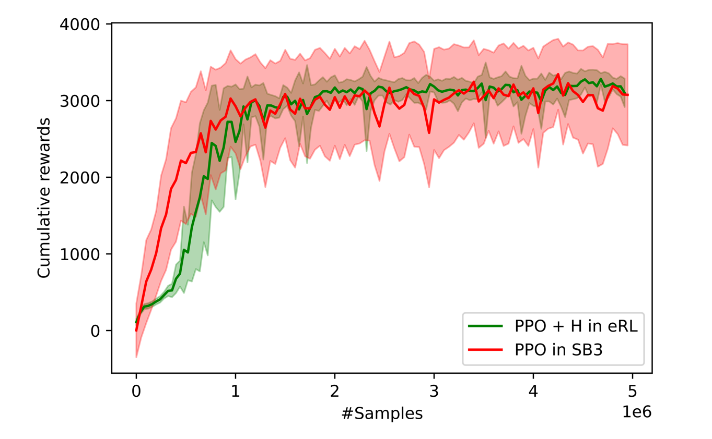
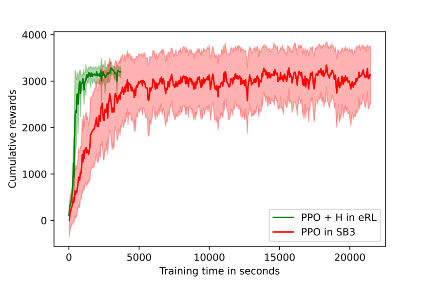

How to learn stably: H-term
======================================================

Stability plays a key role in productizing DRL applications to real-world problems, making it a central concern of DRL researchers and practitioners. Recently, a lot of algorithms and open-source software have been developed to address this challenge. A popular open-source library `Stable-Baselines3 <https://github.com/DLR-RM/stable-baselines3>`_ offers a set of reliable implementations of DRL algorithms that match prior results.

In this article, we introduce a **Hamiltonian-term (H-term)**, a generic add-on in ElegantRL that can be applied to existing model-free DRL algorithms. The H-term essentially trades computing power for stability.

Basic Idea
-----------------------------------------------
In a standard RL problem, a decision-making process can be modeled as a Markov Decision Process (MDP). The Bellman equation gives the optimality condition for MDP problems:

.. image:: ../images/bellman.png
   :width: 80%
   :align: center

The above equation is inherently recursive, so we expand it as follows:

In practice, we aim to find a policy that maximizes the Q-value. By taking a variational approach, we can rewrite the Bellman equation into a Hamiltonian equation. Our goal then is transformed to find a policy that minimizes the energy of a system. (Check our `paper <https://www.semanticscholar.org/paper/Quantum-Tensor-Networks-for-Variational-Learning-Liu-Fang/caa14bff1573192b94fe37b8803b6f788d30f472>`_ for details).

A Simple Add-on
-----------------------------------------------
The derivations and physical interpretations may be a little bit scary, however, the actual implementation of the H-term is super simple. Here, we present the pseudocode and make a comparison (marked in red) to the Actor-Critic algorithms:

As marked out in lines 19–20, we include an additional update of the policy network, in order to minimize the H-term. Different from most algorithms that optimize on a single step (batch of transitions), we emphasize the importance of the sequential information from a trajectory (batch of trajectories).

It is a fact that optimizing the H-term is compute-intensive, controlled by the hyper-parameter L (the number of selected trajectories) and K (the length of each trajectory). Fortunately, ElegantRL fully supports parallel computing from a single GPU to hundreds of GPUs, which provides the opportunity to trade computing power for stability.

Example: Hopper-v2
-----------------------------------------------
Currently, we have implemented the H-term into several widely-used DRL algorithms, PPO, SAC, TD3, and DDPG. Here, we present the performance on a benchmark problem `Hopper-v2 <https://gym.openai.com/envs/Hopper-v2/>`_ using PPO algorithm.

The implementations of PPO+H in `here <https://github.com/AI4Finance-Foundation/ElegantRL/blob/master/elegantrl/agents/AgentPPO_H.py>`_

   

In terms of variance, it is obvious that ElegantRL substantially outperforms Stable-Baseline3. The variance over 8 runs is much smaller. Also, the PPO+H in ElegantRL completed the training process of 5M samples in about 6x faster than Stable-Baseline3.
