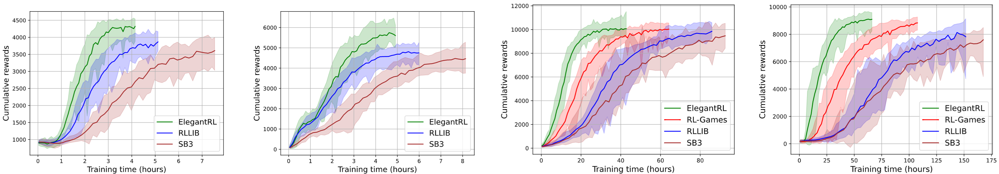

How to run worker parallelism: Isaac Gym
======================================================

In the previous tutorial, we present how to create a GPU-accelerated VecEnv that takes a batch of actions and returns a batch of transitions for every step.

Besides the user-customized VecEnv, ElegantRL supports external VecEnv, e.g., NVIDIA Isaac Gym. In this tutorial, we select Isaac Gym as an example to show how to utilize such a VecEnv to realize the massively parallel simulation (worker parallelism) in ElegantRL. 

What is NVIDIA Isaac Gym?
-----------------------------------------------

NVIDIA Isaac Gym is NVIDIA’s physics simulation environment for reinforcement learning research, an end-to-end high performance robotics simulation platform. It leverages NVIDIA PhysX to provide a GPU-accelerated simulation back-end and enables thousands of environments to run in parallel on a single workstation, achieving 2-3 orders of magnitude of training speed-up in continuous control tasks.

Features:

    - Implementation of multiple highly complex robotic manipulation environments which can be simulated at hundreds of thousands of steps per second on a single GPU.
    
    - High-fidelity GPU-accelerated robotics simulation with a variety of environment sensors - position, velocity, force, torque, etc.
    
    - A Tensor API in Python providing direct access to physics buffers by wrapping them into PyTorch tensors without going through any CPU bottlenecks. 
    
    - Support for importing URDF and MJCF files with automatic convex decomposition of imported 3D meshes for physical simulation.

Here is a visualization of humanoid in Isaac Gym:

.. image:: ../images/isaacgym.gif
   :width: 80%
   :align: center
   
For more information, please view its recently released paper at https://arxiv.org/abs/2108.10470.

To install Isaac Gym, please follow the instructions at https://developer.nvidia.com/isaac-gym.

Experiments on Ant and Humanoid
----------------------------------------

**Ant and humanoid** are two canonical robotic control tasks that simulate an ant and a humanoid, respectively, where each task has both MuJoCo version and Isaac Gym version. The ant task is a simple environment to simulate due to its stability in the initial state, while the humanoid task is often used as a testbed for locomotion learning. Even though the implementations of MuJoCo and Isaac Gym are slightly different, the objective of both is to have the agent move forward as fast as possible.

On one DGX-2 server, we compare ElegantRL-podracer with RLlib, since both support multiple GPUs. ElegantRL-podracer used PPO from ElegantRL, while in RLlib we used the Decentralized Distributed Proximal Policy Optimization (DD-PPO) algorithm that scales well to multiple GPUs. For fair comparison, we keep all adjustable parameters and computing resources the same, such as the depth and width of neural networks, total training steps/time, number of workers, and GPU and CPU resources. Specifically, we use a batch size of 1024, learning rate of 0.001, and a replay buffer size of 4096 across tasks. 

We employ two different metrics to evaluate the agent's performance:
    1. Episodic reward vs. training time (wall-clock time): we measure the episodic reward at different training time, which can be affected by the convergence speed, communication overhead, scheduling efficiency, etc.
    2. Episodic reward vs. #samples: from the same testings, we also measure the episodic reward at different number of samples. This result can be used to investigate the massive parallel simulation capability of GPUs, and also check the algorithm's performance.
    
.. image:: ../images/envs.png
   :width: 80%
   :align: center
   

.. image:: ../images/performance1.png
   :width: 80%
   :align: center
   
Running NVIDIA Isaac Gym in ElegantRL
------------------------------------------

ElegantRL provides a wrapper ``IsaacVecEnv`` to process an Isaac Gym environment:

.. code-block:: python

    from elegantrl.envs.IsaacGym import IsaacVecEnv, IsaacOneEnv
    import isaacgym
    import torch  # import torch after import IsaacGym modules

    env_func = IsaacVecEnv
    env_args = {
        'env_num': 4096,
        'env_name': 'Ant',
        'max_step': 1000,
        'state_dim': 60,
        'action_dim': 8,
        'if_discrete': False,
        'target_return': 14000.0,

        'device_id': None,  # set by worker
        'if_print': False,  # if_print=False in default
    }

Once we have the ``env_func`` and ``env_args``, we can follow the same training procedure as we listed in the BipedalWalker and LunarLander examples. 

Initialize agent and environment, specify hyper-parameters, and start training:

.. code-block:: python

    from elegantrl.agents.AgentPPO import AgentPPO
    from elegantrl.run import train_and_evaluate_mp
    
    args = Arguments(agent=AgentPPO, env_func=env_func, env_args=env_args)
    
    '''set one env for evaluator'''
    args.eval_env_func = IsaacOneEnv
    args.eval_env_args = args.env_args.copy()
    args.eval_env_args['env_num'] = 1

    '''set other hyper-parameters'''
    args.net_dim = 2 ** 9
    args.batch_size = args.net_dim * 4
    args.target_step = args.max_step
    args.repeat_times = 2 ** 4

    args.save_gap = 2 ** 9
    args.eval_gap = 2 ** 8
    args.eval_times1 = 2 ** 0
    args.eval_times2 = 2 ** 2

    args.worker_num = 1
    args.learner_gpus = 0
    train_and_evaluate_mp(args)
