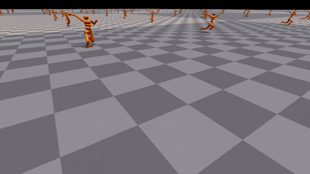

How to run worker parallelism: Isaac Gym
======================================================

In the previous tutorial, we present how to create a GPU-accelerated VecEnv that takes a batch of actions and returns a batch of transitions for every step.

Besides the user-customized VecEnv, ElegantRL supports external VecEnv, e.g., NVIDIA Isaac Gym. In this tutorial, we select Isaac Gym as an example to show how to utilize such a VecEnv to realize the massively parallel simulation (worker parallelism) in ElegantRL. 

What is NVIDIA Isaac Gym?
-----------------------------------------------

NVIDIA Isaac Gym is NVIDIA’s physics simulation environment for reinforcement learning research, an end-to-end high performance robotics simulation platform. It leverages NVIDIA PhysX to provide a GPU-accelerated simulation back-end and enables thousands of environments to run in parallel on a single workstation, achieving 2-3 orders of magnitude of training speed-up in continuous control tasks.

Features:

    - Implementation of multiple highly complex robotic manipulation environments which can be simulated at hundreds of thousands of steps per second on a single GPU.
    
    - High-fidelity GPU-accelerated robotics simulation with a variety of environment sensors - position, velocity, force, torque, etc.
    
    - A Tensor API in Python providing direct access to physics buffers by wrapping them into PyTorch tensors without going through any CPU bottlenecks. 
    
    - Support for importing URDF and MJCF files with automatic convex decomposition of imported 3D meshes for physical simulation.

Here is a visualization of humanoid in Isaac Gym:

   
For more information, please view its recently released paper at https://arxiv.org/abs/2108.10470.

To install Isaac Gym, please follow the instructions at https://developer.nvidia.com/isaac-gym.

Running NVIDIA Isaac Gym in ElegantRL
------------------------------------------

ElegantRL provides a wrapper ``IsaacVecEnv`` to process an Isaac Gym environment:

.. code-block:: python

    from elegantrl.envs.IsaacGym import IsaacVecEnv, IsaacOneEnv
    import isaacgym
    import torch  # import torch after import IsaacGym modules

    env_func = IsaacVecEnv
    env_args = {
        'env_num': 4096,
        'env_name': 'Ant',
        'max_step': 1000,
        'state_dim': 60,
        'action_dim': 8,
        'if_discrete': False,
        'target_return': 14000.0,

        'device_id': None,  # set by worker
        'if_print': False,  # if_print=False in default
    }

Once we have the ``env_func`` and ``env_args``, we can follow the same training procedure as we listed in the BipedalWalker and LunarLander examples. 

Initialize agent and environment, specify hyper-parameters, and start training:

.. code-block:: python

    from elegantrl.agent.AgentPPO import AgentPPO
    from elegantrl.run import train_and_evaluate_mp
    
    args = Arguments(agent=AgentPPO, env_func=env_func, env_args=env_args)
    
    '''set one env for evaluator'''
    args.eval_env_func = IsaacOneEnv
    args.eval_env_args = args.env_args.copy()
    args.eval_env_args['env_num'] = 1

    '''set other hyper-parameters'''
    args.net_dim = 2 ** 9
    args.batch_size = args.net_dim * 4
    args.target_step = args.max_step
    args.repeat_times = 2 ** 4

    args.save_gap = 2 ** 9
    args.eval_gap = 2 ** 8
    args.eval_times1 = 2 ** 0
    args.eval_times2 = 2 ** 2

    args.worker_num = 1
    args.learner_gpus = 0
    train_and_evaluate_mp(args)
