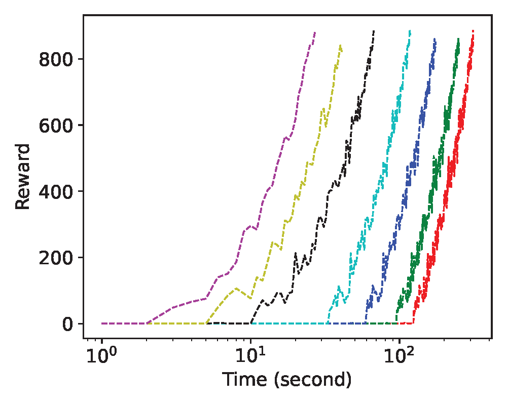

# RLSolver: GPU-based Massively Parallel Environments for Combinatorial Optimization (CO) Problems Using Reinforcement Learning

We aim to showcase the effectiveness of massively parallel environments for combinatorial optimization (CO) problems using reinforcement learning (RL). RL with the help of GPU based parallel environments can significantly improve the sampling speed and can obtain high-quality solutions within short time. 

# Overview

RLSolver has three layers:
- Environments: providing massively parallel environments using GPUs.
- RL agents: providing RL algorithms, e.g., REINFORCE.
- Problems: typical CO problems, e.g., graph maxcut and TNCO.

<a target="\_blank">
	<div align="center">
		
	</div>
</a>  

# Key Technologies
- **GPU-based Massively parallel environments** of Markov chain Monte Carlo (MCMC) simulations on GPU using thousands of CUDA cores and tensor cores.
- **Distribution-wise** is __much much faster__ than the instance-wise methods (such as MCPG and iSCO), since we can obtain the results directly by inference.

# Why Use GPU-based Massively Parallel Environments?

The bottleneck of using RL for solving CO problems is the sampling speed since existing solver engines (a.k.a, gym-style environments) are implemented on CPUs. Training the policy network is essentially estimating the gradients via a Markov chain Monte Carlo (MCMC) simulation, which requires a large number of samples from environments. 

Existing CPU-based environments have two significant disadvantages: 1) The number of CPU cores is typically small, generally ranging from 16 to 256, resulting in a small number of parallel environments. 2) The communication link between CPUs and GPUs has limited bandwidth. The massively parallel environments can overcome these disadvantages, since we can build thounsands of environments and the communication bottleneck between CPUs and GPUs is bypassed; therefore the sampling speed is significantly improved. 

# Sampling Speed of GPU-based Massively Parallel Environments

<p align="center">
  
&nbsp; &nbsp; &nbsp; &nbsp;
  
</p>

<a target="\_blank">
	<div align="center">
		
	</div>
</a> 

From the above figures, we used CPU and GPU based environments. We see that the sampling speed is improved by at least 2 orders by using GPU-based massively parallel environments compared with conventional CPUs.

# Two Patterns

<a target="\_blank">
	<div align="center">
		
	</div>
</a>  

__Pattern I__: RL-based heuristic formulates the CO problem as Markov decision process (MDP), and then use RL algorithms to select the node and add it into a node set. There are three important functions for a gym-style environment:  
- reset(): Set the selected nodes as an empty set. 
- step(): Select the node with the maximum Q-value and then add it to the set.  
- reward(): Calculate the objective values over all parallel environments.

__Pattern II__: policy-based methods first formulate the CO problem as a QUBO problem, and then learn a policy using say REINFORCE algorithm to minimize the Hamiltonian objective function. Here, the __policy is a vector of probabilities__ of the nodes belong to the set. For example, the policy for a graph with 3 nodes is [0, 0, 0.9] means that the probabilities of the first two nodes belong to the set are 0, and the probability of the third node belong to the set is 0.9. We introduce four important functions for all parallel environments:  
- reset(): Generate random initial solutions for all parallel environments. 
- step(): Search for better solutions based on the current solutions. It has two sub-functions. 
  - sampling() is the sampling method.
  - local_search() returns a better solution by flipping some bits. It can improve the quality of the current solution in a local domain. 
- pick\_good\_xs(): Select the good solutions in all parallel environments, where each environment returns exactly one good solution with corresponding objective value.
- obj(): Calculate the objective values.

# Example (Graph Maxcut)

<a target="\_blank">
	<div align="center">
		
	</div>
</a> 

Pattern I: In left part of of the above figure, the initial state is empty, i.e., no node is selected. Then we select node 1 with the maximum Q-value and add it to the state, thus the new state is [1], and the reward is 2.

Pattern II: In right part of the above figure, the current state is [2, 3], i.e., node 2 and 3 are selected, and the objective value is 2. The new state is [1, 3, 4], i.e., node 1, 3, and 4 are selected, and the objective value is 4. 

# Implementation for GPU-based Parallelism

- All states and objective values are stored by __PyTorch Tensors__, so that they are mapped to CUDA cores and tensor cores of GPUs.

- We use __vmap__ (one GPU) or __pmap__ (multiple GPUs) to push the map into PyTorch operations, effectively vectorizing those operations.

For example, we calculate the objective values of states over all parallel environments by using the following codes:
```
from torch import vmap
batched_obj = vmap(objective)
objs = batched_obj(states)
```
where "objective" is the calculation of the objective value for one state.  

__Dimension of states and objective values:__ The states over all parallel environments are stored as PyTorch tensors with the environments as the first dimension and the graph nodes as the second dimension. For example, for the graph with 100 nodes, and we use 1000 environments, and the dimension of states is 1000 * 100. Correspondingly, the dimension of the objective values over all parallel environments is 1000 * 1. 


# Key References

- Mazyavkina, Nina, et al. "Reinforcement learning for combinatorial optimization: A survey." Computers & Operations Research 134 (2021): 105400.

- Bengio, Yoshua, Andrea Lodi, and Antoine Prouvost. "Machine learning for combinatorial optimization: a methodological tour d’horizon." European Journal of Operational Research 290.2 (2021): 405-421.

- Peng, Yun, Byron Choi, and Jianliang Xu. "Graph learning for combinatorial optimization: a survey of state-of-the-art." Data Science and Engineering 6, no. 2 (2021): 119-141.

- Nair, Vinod, et al. "Solving mixed integer programs using neural networks." arXiv preprint arXiv:2012.13349 (2020).

- Makoviychuk, Viktor, et al. "Isaac Gym: High performance GPU based physics simulation for robot learning." Thirty-fifth Conference on Neural Information Processing Systems Datasets and Benchmarks Track (Round 2). 2021.


# Dependencies

Python>=3.7

PyTorch=2.0.0

Numpy>=1.23

## File Structure

```
RLSolver
└──data
└──docs
└──result
└──envs
    └──env_isco_maxcut.py
    └──env_l2a_maxcut.py
    └──env_l2a_TNCO.py
└──methods
    └──L2A (ours)
    └──S2V-DQN
    └──RUN-CSP
    └──iSCO
    └──PI-GNN
    └──tsp_alg // TSP algorithms
    └──config.py
    └──genetic_algorithm.py
    └──greedy.py
    └──gurobi.py
    └──mcpg.py
    └──random_walk.py
    └──scip.py
    └──simulated_annealing.py
    └──util.py
    └──util_generate.py
    └──util_obj.py
    └──util_read_data.py
    └──util_results.py
└──README.md
```

## Datasets

- [Gset](https://web.stanford.edu/~yyye/yyye/Gset/) is opened by Standford university, and is stored in the "data" folder of this repo. The number of nodes is from 800 to 10000. 
  
- __Syn__ is the synthetic data. The number of nodes is from 100 to 1000 which in three distributions: barabasi albert (BA), erdos renyi (ER), and powerlaw (PL). Each dataset in generated graphs has 10 instances. The partial synthetic data is stored in the "data" folder of this repo.
- 
Take g14.txt (an undirected graph with 800 nodes and 4694 edges) as an example:

800 4694 # #nodes is 800, and #edges is 4694.

1 7 1 # node 1 connects with node 7, weight = 1

1 10 1 # node 1 connects node 10,  weight = 1

1 12 1 # node 1 connects node 12, weight = 1


## Results


Results will be written to the file "result.txt" in the folder "result". Take graph maxcut as an example. The first column is the node, and the second column is the label of the set.

1 2  # node 1 in set 2

2 1  # node 2 in set 1

3 2  # node 3 in set 2

4 1  # node 4 in set 1

5 2  # node 5 in set 2

## Run Methods

- 1: select problem

config.py
```
PROBLEM = Problem.maxcut
```
We can select a problem such as maxcut. 

- 2: select dataset

Take methods/greedy.py as an example:

```
 directory_data = '../data/syn_BA' # the directory of datasets
 prefixes = ['barabasi_albert_100_'] # select the graphs with 100 nodes
```

- 3: run method

```
python methods/greedy.py  # run greedy
python methods/gurobiy.py  # run gurobi
python methods/simulated_annealing.py  # run simulated_annealing
python methods/mcpg.py  # run mcpg
python methods/iSCO/main.py  # run iSCO
python methods/PI-GNN/main.py  # run PI-GNN
```
```
python methods/L2A/maxcut_end2end.py  # ours
```


## Commercial Solvers to Compare with

[Gurobi](https://www.gurobi.com/)


## Existing Methods

* RL-based annealing using massively parallel enironments
  
[code](https://github.com/zhumingpassional/RLSolver) 2023 NeurIPS Classical Simulation of Quantum Circuits: Parallel Environments and Benchmark

[code](https://github.com/zhumingpassional/RLSolver) 2023 NeurIPS workshop K-Spin Ising Model for Combinatorial Optimizations over Graphs: A Reinforcement Learning Approach

[code](https://github.com/AI4Finance-Foundation/ElegantRL) 2021 NeurIPS workshop ElegantRL-Podracer: Scalable and Elastic Library for Cloud-Native Deep Reinforcement Learning

* RL/ML-based heuristic
  
[code](https://github.com/Hanjun-Dai/graph_comb_opt) (greedy) 2017 NeurIPS Learning Combinatorial Optimization Algorithms over Graphs

[code](https://github.com/optsuite/MCPG) (local search) 2023, A Monte Carlo Policy Gradient Method with Local Search for Binary Optimization

[code](https://github.com/JHL-HUST/VSR-LKH) (LKH for TSP) 2021 AAAI Combining reinforcement learning with Lin-Kernighan-Helsgaun algorithm for the traveling salesman problem 

* Variational annealing

[code](https://github.com/RNN-VCA-CO/RNN-VCA-CO) (VCA_RNN) 2023 Machine_Learning Supplementing recurrent neural networks with annealing to solve combinatorial optimization problems

[code](https://github.com/VectorInstitute/VariationalNeuralAnnealing) (VNA) 2021 Nature Machine_Intelligence Variational neural annealing

* Discrete sampling

[code](https://github.com/zhumingpassional/RLSolver/tree/master/methods/iSCO) (iSCO) 2023 ICML Revisiting Sampling for Combinatorial Optimization
  
* Learning to branch
  
[code](https://github.com/cwfparsonson/retro_branching/tree/master) 2023 AAAI Reinforcement Learning for Branch-and-Bound Optimisation using Retrospective Trajectories 

[code](https://github.com/ds4dm/branch-search-trees) 2021 AAAI Parameterizing Branch-and-Bound Search Trees to Learn Branching Policies

* Learning to cut

[code](https://github.com/Wenbo11/learntocut) 2020 ICML Reinforcement learning for integer programming: Learning to cut

* Classical methods
  - [Greedy](https://github.com/zhumingpassional/RLSolver/blob/master/methods/greedy.py)
  - [Simulated annealing](https://github.com/zhumingpassional/RLSolver/blob/master/methods/simulated_annealing.py)
  - [Genetic algorithm](https://github.com/zhumingpassional/RLSolver/blob/master/methods/genetic_algorithm.py)
  - [Random walk](https://github.com/zhumingpassional/RLSolver/blob/master/methods/random_walk.py)
  - Local search
  - Beam search
  - Tabu search
  - Branch-and-bound
  - Cutting plane


## Results for Graph Maxcut

In the following experiments, we used GPU during training by default. The best-known results are labled in bold. The "obj bound" is the bound of the objective value, which is calculated by Gurobi, and any solution can not exceed this value. 

1) Instance-wise (Gset)

We use the instance-wise version of L2A, i.e., end to end, in the dataset [Gset](https://web.stanford.edu/~yyye/yyye/Gset/), which is opened by Stanford university. 

| Graph | Nodes| Edges | BLS | DSDP    | KHLWG     | RUN-CSP| PI-GNN| Gurobi (1 h)  |Gap         | Obj bound |iSCO   | MCPG     | Ours | Improvement |  
|--- |------|----  |---        |-----    |-----    |--------|-------| ---           | ---        | ----      | ----  | ----     | ---- | ----|
|    |      |  |       |  |    |                            |Pattern I|         |                |           | Pattern I| Pattern II| Pattern II|   |
|G14 | 800  | 4694 | __3064__  |         | 2922    | 3061   | 2943  |3037           | 4.28\%     |3167       |  3056 |__3064__  | __3064__ | +0\%|
|G15 | 800  | 4661 | __3050__  | 2938    |__3050__ | 2928   | 2990  |3022           |4.37\%      |3151       |  3046 |__3050__  | __3050__ | +0\% | 
|G22 | 2000 | 19990|__13359__  | 12960   |__13359__| 13028  | 13181 |13217          | 30.56\%    |17256      |  13289|__13359__ | __13359__ |  +0\% | 
|G49 | 3000 | 6000 | __6000__  | __6000__|__6000__ |__6000__| 5918  |__6000__       |0           |6000       | 5940  |__6000__  | __6000__|  +0\% | 
|G50 | 3000 | 6000 | __5880__  | __5880__|__5880__ |__5880__| 5820  |__5880__       |0.51\%      |5910       | __5880__  |__5880__  | __5880__|  +0\% | 
|G55 | 5000 | 12468| 10294     | 9960    | 10236   | 10116  | 10138 | 10115         | 17.09\%    |11844      | 10218 | 10296    |__10298__ |  +0.04\% | 
|G70 | 10000| 9999 |9541       | 9456    | 9458    | -      | 9421  | 9579          |1.75\%      |9747       |  9442 | 9578     |__9586__ | +0.47\% | 

2) Distribution-wise (synthetic data)

We use the distribution-wise version of L2A in the synthetic datasets in 3 distributions: barabasi albert (BA), erdos renyi (ER), and powerlaw (PL). That is, after training, we test the instances by inferring the neural networks. The distribution-wise version of L2A is __much much faster__ than the instance-wise methods (such as MCPG and iSCO), since we can obtain the results directly by inference. For graphs with $n ~ (100 \leq 1000)$ nodes, there are 10 datasets, and we calcualte the average of the obtained objective values. 

Results on the BA distribution.
|Nodes | Greedy | SDP  | SA       | GA     | Gurobi (1 h)|Obj bound | PI-GNN | iSCO   | MCPG   | Ours  | 
|----------|-------|------| -------- |--------|--------  | ------   | ------ |------  |--------|------ |
||||  ||     | | Pattern I |Pattern I  |Pattern II| Pattern II |
|100   |272.1  |272.5 | 272.3  |__284.1__ |__284.1__     | 284.1 | 273.0  |__284.1__|__284.1__| __284.1__|
|200   |546.9  |552.9 | 560.2    |582.9   |__583.0__     | 583.0 | 560.6  |581.5   |__583.0__| __583.0__ |
|300   | 833.2 |839.3 | 845.3  |__880.4__   |__880.4__   | 880.4 |  846.3 |877.2   |__880.4__ | __880.4__  |
|400   |1112.1 |1123.9| 1134.6   |1180.9  |1180.4        |1195.1 | 1174.6 |1176.5  |1179.5| __1181.9__ |
|500   |1383.8 |1406.3| 1432.8   |1477.7  |1476.0        |1523.2 | 1436.8 |1471.3  |__1478.3__| __1478.3__ |
|600   |1666.7 |1701.2| 1770.3   |1780.3  |1777.0        |1867.7 | 1768.5 |1771.0  |1778.6| __1781.5__ |
|700   |1961.9 |1976.7| 1984.3   |1989.2  |2071.2        |2197.3 | 1989.4 |2070.2  |__2076.6__| __2076.6__ |  
|800   |2237.9 |2268.8| 2273.6   |2375.5  |2358.9        |2539.5 | 2365.9 |2366.9  |2372.9| __2377.8__ |
|900   |2518.1 |2550.3| 2554.3   |2670.1  |2658.3        |2866.6 | 2539.7 |2662.4  |2670.6| __2675.1__|
|1000  |2793.8 |2834.3| 2856.2   |2967.9  |2950.2        |3217.6 | 2846.8 |2954.0  |2968.7| __2972.3__ |


